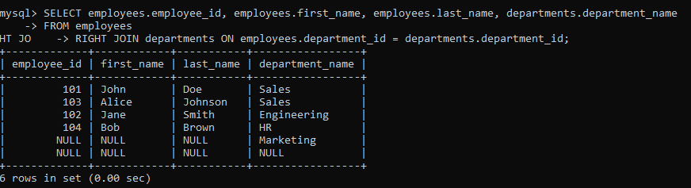

# WSL MYSQL STARTUP
> [!NOTE]
> In progress
## mysql
*   sudo mysql
*   sudo mysql -u root
*   CREATE USER 'oleg'@'localhost' IDENTIFIED BY 'your_password';
*   GRANT ALL PRIVILEGES ON *.* TO 'oleg'@'localhost' WITH GRANT OPTION;
*   тестовая бд для join
    *   CREATE TABLE departments (
    department_id INT PRIMARY KEY,
    department_name VARCHAR(50)
);

CREATE TABLE employees (
    employee_id INT PRIMARY KEY,
    first_name VARCHAR(50),
    last_name VARCHAR(50),
    department_id INT,
    salary DECIMAL(10, 2),
    FOREIGN KEY (department_id) REFERENCES departments(department_id)
);

   *   INSERT INTO departments (department_id, department_name) VALUES
(1, 'Sales'),
(2, 'Engineering'),
(3, 'HR'),
(4, 'Marketing'),
(5, NULL);

INSERT INTO employees (employee_id, first_name, last_name, department_id, salary) VALUES
(101, 'John', 'Doe', 1, 60000),
(102, 'Jane', 'Smith', 2, 80000),
(103, 'Alice', 'Johnson', 1, 65000),
(104, 'Bob', 'Brown', 3, 70000),
(105, 'Carol', 'Davis', NULL, 55000);
* joins
    *   INNER JOIN Только те строки, где department_id совпадает в обеих таблицах, будут возвращены.
    *   LEFT JOIN Все строки из employees будут возвращены, даже если в departments нет совпадающего department_id. Столбцы из departments будут содержать NULL, если нет совпадения
    *   RIGHT JOIN Все строки из departments будут возвращены, даже если в employees нет совпадающего department_id. Столбцы из employees будут содержать NULL, если нет совпадения.
    *   FULL JOIN Все строки из обеих таблиц будут возвращены. Столбцы будут содержать NULL, если нет совпадения в другой таблице. MySQL не поддерживает FULL JOIN напрямую, но можно эмулировать его с помощью UNION.
    *   CROSS JOIN Каждая строка из employees будет соединена с каждой строкой из departments, что может привести к большому количеству строк в результате.
    *   SELF JOIN Этот запрос найдет пары сотрудников, работающих в одном отделе, но при этом исключит самих себя из пары. = этого оператора самого по себе нету в sql используют left right или inner => заменяется where

SELECT e1.first_name AS employee, e2.first_name AS manager
FROM employees e1
LEFT JOIN employees e2 ON e1.manager_id = e2.employee_id;

full join = union
SELECT employees.employee_id, employees.first_name, employees.last_name, departments.department_name
FROM employees
LEFT JOIN departments ON employees.department_id = departments.department_id
UNION
SELECT employees.employee_id, employees.first_name, employees.last_name, departments.department_name
FROM employees
RIGHT JOIN departments ON employees.department_id = departments.department_id;

наши бд

вывод лефт джоина

вывод райт джоина

